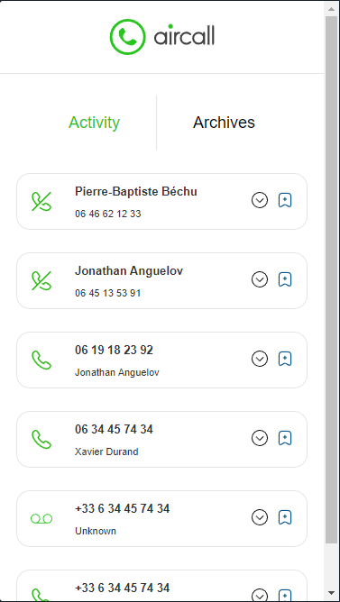
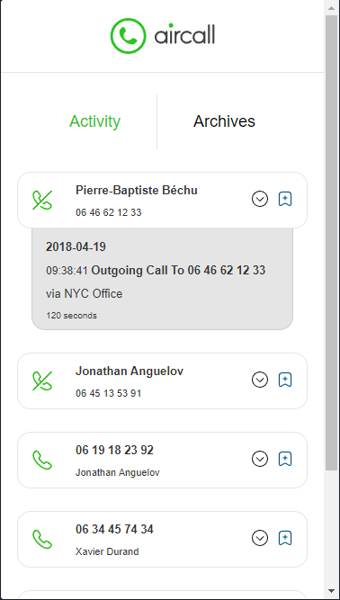
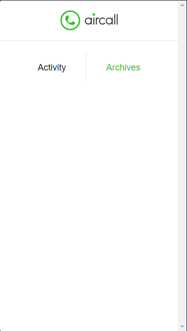
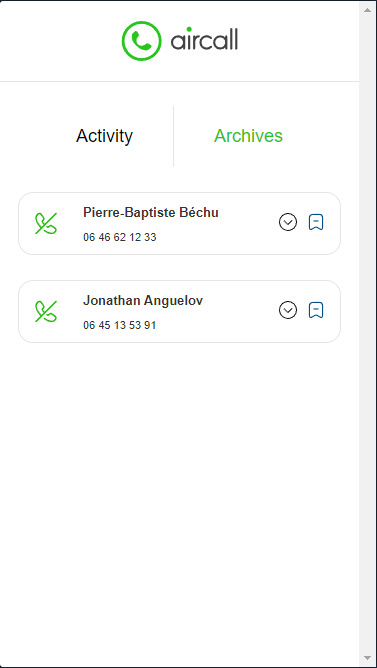
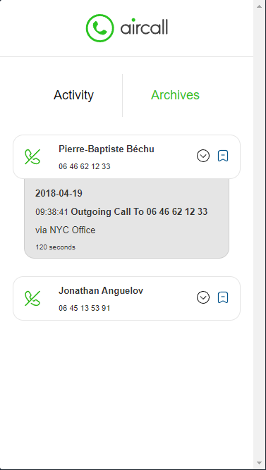

# Aircall: LeapGrad Frontend Development Assesment

View the deployed app here: https://aircall-leap.netlify.app/

Project Description: Users can view basic call information like whether the call was missed, answered, or went to voice mail. As well as who placed the call, and who it was to. You can click the more details button to view more specific information, such as the date and time the call was made. You can also view from where the call was placed, as well as how long it lasted. Users can also archive a call. Once a call is archived, it is no longer displayed on the activity feed, and is instead viewable on the archives screen. Users can switch to the archives screen to view archived calls, as well as unarchive the calls to bring them back to the activity feed.

The features of the app include:
- View basic call information
- View additional call information
- Archive and Unarchive calls
- View archived calls

Some features I would like to include if I had more time:
- Adding animations and transitions
- Unit testing
- Save which calls have been archived to local storage

## Local Build
### `npm start`

Runs the app in the development mode.\
Open [http://localhost:3000](http://localhost:3000) to view it in the browser.

​The app on the activity screen:

​The app on the activity screen showing more details:

Empty archives screen:

Archives screen with archived calls:

Archives screen with archived calls showing more details:

